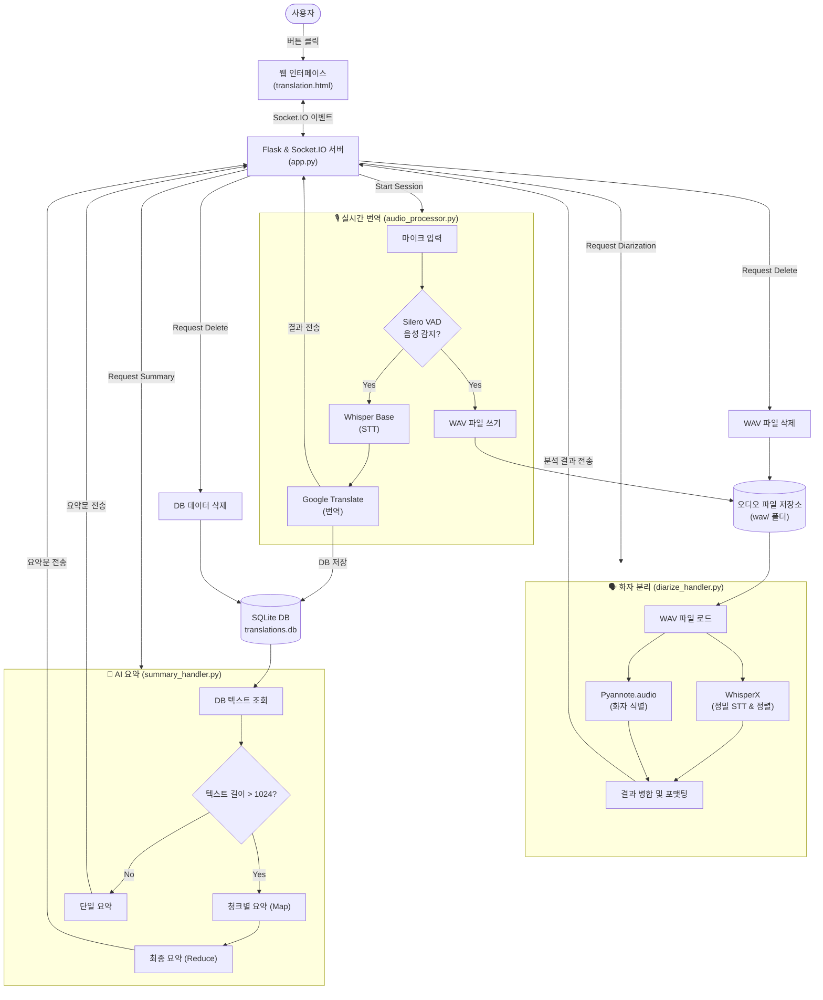

```mermaid
flowchart TD
    %% --- 사용자 및 인터페이스 ---
    User([사용자])
    UI["웹 인터페이스<br/>(translation.html)"]

    %% --- 메인 서버 ---
    Server["Flask & Socket.IO 서버<br/>(app.py)"]

    %% --- 저장소 ---
    DB[("SQLite DB<br/>translations.db")]
    WavFiles[("오디오 파일 저장소<br/>(wav/ 폴더)")]

    %% --- 연결 ---
    User -->|버튼 클릭| UI
    UI <-->|"Socket.IO 이벤트"| Server

    %% =================================================
    %% 1. 실시간 번역 프로세스 (Audio Processor)
    %% =================================================
    subgraph RealTime ["🎙️ 실시간 번역 (audio_processor.py)"]
        Mic[마이크 입력]
        VAD{"Silero VAD<br/>음성 감지?"}
        STT["Whisper Base<br/>(STT)"]
        Trans["Google Translate<br/>(번역)"]
        SaveWav[WAV 파일 쓰기]

        Mic --> VAD
        VAD -- Yes --> SaveWav
        VAD -- Yes --> STT
        STT --> Trans
    end

    %% 실시간 흐름 연결
    Server -->|"Start Session"| RealTime
    SaveWav --> WavFiles
    Trans -->|"결과 전송"| Server
    Trans -->|"DB 저장"| DB

    %% =================================================
    %% 2. 후처리: 화자 분리 (Diarize Handler)
    %% =================================================
    subgraph Diarization ["🗣️ 화자 분리 (diarize_handler.py)"]
        LoadWav[WAV 파일 로드]
        WhisperX["WhisperX<br/>(정밀 STT & 정렬)"]
        Pyannote["Pyannote.audio<br/>(화자 식별)"]
        Combine[결과 병합 및 포맷팅]

        LoadWav --> WhisperX
        LoadWav --> Pyannote
        WhisperX --> Combine
        Pyannote --> Combine
    end

    %% 화자 분리 흐름 연결
    Server -->|"Request Diarization"| Diarization
    WavFiles --> LoadWav
    Combine -->|"분석 결과 전송"| Server

    %% =================================================
    %% 3. 후처리: 요약 (Summary Handler)
    %% =================================================
    subgraph Summarization ["📑 AI 요약 (summary_handler.py)"]
        FetchText[DB 텍스트 조회]
        MapReduce{"텍스트 길이 > 1024?"}
        ChunkSum["청크별 요약 (Map)"]
        FinalSum["최종 요약 (Reduce)"]
        SimpleSum[단일 요약]

        FetchText --> MapReduce
        MapReduce -- Yes --> ChunkSum --> FinalSum
        MapReduce -- No --> SimpleSum
    end

    %% 요약 흐름 연결
    Server -->|"Request Summary"| Summarization
    DB --> FetchText
    FinalSum -->|"요약문 전송"| Server
    SimpleSum -->|"요약문 전송"| Server

    %% =================================================
    %% 4. 데이터 관리
    %% =================================================
    Server -->|"Request Delete"| DBDelete[DB 데이터 삭제]
    Server -->|"Request Delete"| FileDelete[WAV 파일 삭제]
    DBDelete --> DB
    FileDelete --> WavFiles
```